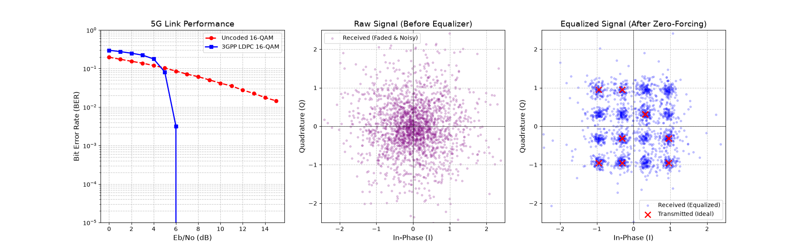

# 3GPP-Compliant 5G Physical Layer Simulator

Welcome to my 5G PHY simulator. I built this project to bridge the gap between theoretical telecommunication mathematics and modern, software defined engineering. 

While textbook formulas are great, I wanted to visually model what actually happens to a wireless signal when it bounces around a messy urban environment, and exactly how modern 5G error correction algorithms mathematically rebuild that data. Built natively on **NVIDIA Sionna** and **TensorFlow**, this simulator acts as a digital sandbox for validating wireless link performance.

## The Architecture

This simulator models a complete, end-to-end digital communication transceiver:

1. **The Transmitter:** Raw binary data is passed through a **3GPP LDPC Encoder** (Rate 1/2) to inject redundant parity bits acting as mathematical armor for the journey. The encoded bits are then mapped onto a **16-QAM** constellation grid.
2. **The Channel:** The signal is blasted through a **Rayleigh Block Fading** channel to simulate the harsh realities of multipath propagation (signals bouncing off buildings and streets), followed by standard Additive White Gaussian Noise (AWGN).
3. **The Receiver:** A **Zero Forcing (ZF) Equalizer** divides out the fading effect to unscramble the phase shifts. An app-based demapper calculates the Log-Likelihood Ratios (LLRs) for each bit, and finally, a **Belief Propagation Decoder** solves the 5G parity equations to correct any bits flipped by the noise.

## Visualizing the Physics (Simulation Dashboard)

Instead of just looking at terminal outputs, I designed a 3-panel dashboard to visualize the physics and the math simultaneously. 



### What the Dashboard Shows:
* **Left (The Proof):** The Bit Error Rate (BER) waterfall curve proves the massive coding gain of 3GPP LDPC. In a fading environment, the uncoded signal degrades heavily, but the 5G LDPC algorithm maintains a near zero error rate at much lower signal power.
* **Center (The Mess):** The raw received signal at 15 dB SNR. This is what the antenna actually sees—a completely unreadable, phase-shifted scatter plot destroyed by multipath fading.
* **Right (The Fix):** The equalized signal. This visually demonstrates the Zero-Forcing equalizer successfully untangling the multipath mess, snapping the scattered points back into distinct 16-QAM clusters so the decoder can read them.

## Pre-requsites

To run this simulation on your own machine,

```bash
# Clone the repository
git clone [https://github.com/your-username/5g-phy-simulator.git](https://github.com/your-username/5g-phy-simulator.git)
cd 5g-phy-simulator

# Install dependencies
pip install -r requirements.txt
```
## Future Roadmap

This repository is designed as a foundational framework. Because the pipeline is built natively on TensorFlow tensors, my next steps are to begin swapping out traditional mathematical blocks for AI/ML alternatives:
- [ ] Migrate the traditional app-based demapper to a Neural Network (Deep Learning) receiver.
- [ ] Implement OFDM framing with Pilot symbol insertion.
- [ ] Replace Perfect CSI with Least Squares (LS) Channel Estimation.
# Run the Monte Carlo simulation
python main.py
